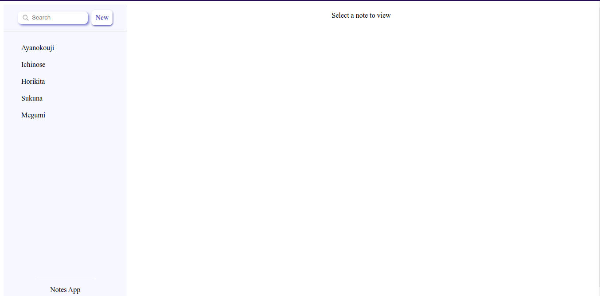

# Notes Web App using MERN Stack

Let's you create, update and delete your notes.

# Library Used

> Axios - To connect to backend

> mongoose - To connect to MongoDB

# To run application on local system

1. Clone this repo.
2. Go into the directory and open it in terminal.
3. Run following commands:

```
cd frontend
npm install
```

4. To start frontend, run:

```
npm run dev
```

5. After installation go to backend directory using

```
cd ../backend
```

6. Run following commands:

```
npm install
```

7. This step is optional if you have mongodb installed. Or make sure that you have docker installed on your system.

```
docker compose up -d
```

If not container does not start running in first turn then again run the same command.

8. To start backend, run:

```
npm start
```

# Application UI




